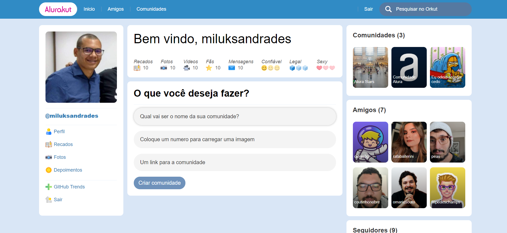

## Alurakut

Projeto desenvolvido na semana de Imersão Alura onde o objetivo é recriar a interface da rede social Orkut.

Link no Vercel: [Clique aqui](https://alurakut-miluksandrades.vercel.app/)

##### Tela Inicial

No primeiro dia foi abordado sobre o layout inicial e o tratamento de arrays Dentro do React.

No segundo dia foi trabalhado o uso de useState e o gerenciamento de estado, insersão de dados por entre os compomentes, manipulação de arrays e componentização de blocos
